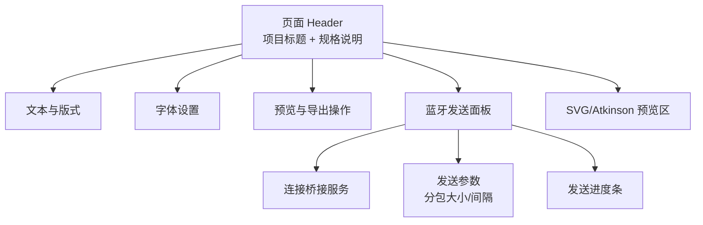
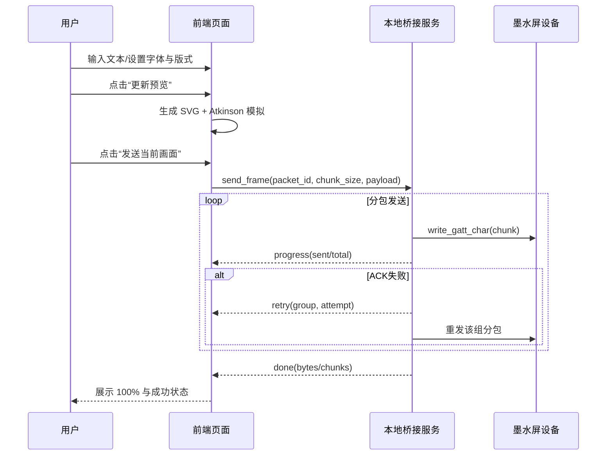

# 前端设计示意图

## 1) 页面信息架构（IA）



## 2) 关键交互流程



## 3) 线框草图（Wireframe）

```text
┌──────────────────────────────────────────────────────────────┐
│ 4.2寸蓝牙墨水屏 SVG 生成器                                  │
│ 规格：黑白红 / 400×300 / Atkinson                          │
├──────────────────────────────────────────────────────────────┤
│ [文本输入框..............................................]   │
│ 方向[横/竖] 颜色[黑/红] 字号[ ] 行高[ ] 边距[ ] 对齐[ ]     │
├──────────────────────────────────────────────────────────────┤
│ 字体：在线下拉[      ] [使用在线字体] [上传字体文件]         │
├──────────────────────────────────────────────────────────────┤
│ [1) 更新预览] [2) 导出SVG]                                  │
├──────────────────────────────────────────────────────────────┤
│ 蓝牙发送（Firefox + Ubuntu bridge）                         │
│ WS地址[ws://127.0.0.1:8765]  MAC[            ] UUID[      ] │
│ 分包大小[180] 分包间隔[15ms]  [连接桥接] [发送当前画面]      │
│ 进度: [██████████░░░░░░] 62%                                │
│ 状态: 发送中 124/200                                         │
├──────────────────────────────────────────────────────────────┤
│ SVG 预览                                                     │
│ [                    画布预览区域                          ] │
│ Atkinson 模拟预览                                            │
│ [                    抖动画布区域                          ] │
└──────────────────────────────────────────────────────────────┘
```
